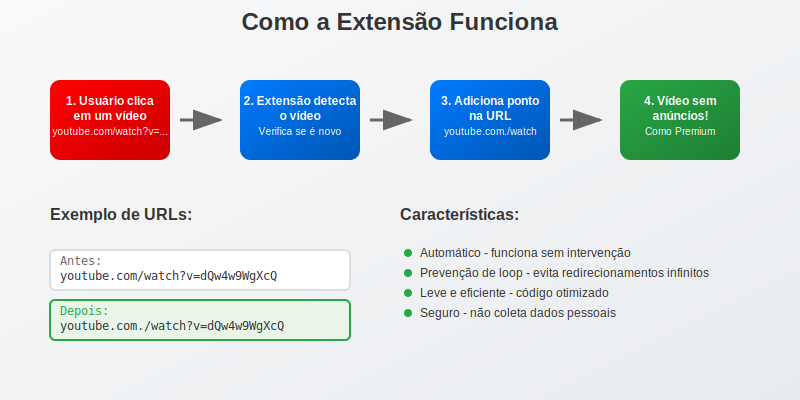

<div align="center">
  
  <h1 align="center">Bug YouTube™ Skip Ads</h1>
  <p align="center">
    <strong>Uma extensão que automatiza um bug para pular anúncios no YouTube de forma simples e eficaz.</strong>
    <br />
    <em>Um projeto que transforma uma descoberta casual de 2015 em uma ferramenta poderosa.</em>
  </p>
</div>

<div align="center">

[](https://github.com/leodigory/Bug-YouTube-Skip-Ads)
[](LICENSE)
[](https://www.google.com/chrome/)

</div>

### 🛠️ **Tech Stack & Ferramentas**
<p align="center">
  
  
  
  
</p>

---

## 🚀 A Gênese de uma Descoberta

A história desta extensão começa muito antes do código. **Por volta de 2015, por pura curiosidade e experimentação, descobri um comportamento peculiar no YouTube:** adicionar um simples ponto (`.`) ao final da URL de um vídeo parecia quebrar a lógica de carregamento de anúncios, pulando-os completamente.

Na época, presumi que fosse uma falha isolada, um truque que só funcionava para mim. Guardei a descoberta e a utilizei por anos. Qual não foi minha surpresa quando, em 2020, vi a notícia se espalhar por portais como o [Olhar Digital](https://olhardigital.com.br/2020/06/12/noticias/um-ponto-na-url-faz-com-que-youtube-seja-exibido-sem-anuncios/) e comunidades no Reddit. Aquele pequeno "hack" pessoal era, na verdade, um bug persistente na plataforma.

Essa validação pública foi o gatilho para transformar um truque manual em uma ferramenta automatizada. Este projeto nasceu da vontade de aplicar minhas habilidades de desenvolvimento para criar uma solução elegante para um problema que eu conhecia intimamente, tornando-a acessível a todos.

## ✨ Visão Geral do Funcionamento

Para o usuário, o processo é invisível. A extensão simplesmente funciona. Mas como? A imagem abaixo ilustra a ideia central de forma simples e direta.

<div align="center">
    
</div>

## 🔧 Mergulho Técnico: Arquitetura e Fluxo de Decisão

Para quem tem interesse nos detalhes técnicos, o diagrama de sequência abaixo demonstra a interação entre os componentes da extensão e a lógica de decisão para evitar recarregamentos desnecessários. Este diagrama mostra a robustez da solução, tratando casos de uso e prevenindo loops.

<div align="center">
  
</div>

### 💡 Destaques de Implementação (Demonstração de Habilidades)
- 🧠 **Prevenção de Loop Inteligente**: Usa `localStorage` para armazenar **apenas a última URL processada**, uma abordagem eficiente em memória que garante que cada vídeo seja modificado apenas uma vez por sessão, evitando o crescimento desnecessário de dados.
- ⚡ **Performance Otimizada**: Código JavaScript leve e sem dependências, com delays estratégicos (`setTimeout`) para garantir que o script só rode após o carregamento dos elementos essenciais da página, demonstrando conhecimento sobre o ciclo de vida de páginas web e a natureza assíncrona do JS.
- 🛡️ **Segurança e Privacidade by Design**: A extensão opera inteiramente no lado do cliente, não coleta dados e solicita apenas as permissões mínimas necessárias, seguindo as boas práticas de desenvolvimento seguro para extensões (Manifest V3).
- 🎯 **Detecção Robusta**: Suporte a múltiplos formatos de URL do YouTube (`/watch`, `/embed`, `/shorts`, etc.) através do uso de expressões regulares, garantindo uma cobertura ampla e manutenível.

## 📦 Instalação Rápida

Siga os passos abaixo para ter a extensão funcionando em menos de um minuto.

1.  **Baixe o Projeto**: Faça o download do código-fonte clicando em `Code` > `Download ZIP` no topo da página, ou clone o repositório com Git.
    ```bash
    git clone https://github.com/leodigory/Bug-YouTube-Skip-Ads.git
    ```
2.  **Acesse a Página de Extensões**:
    -   No Chrome, digite `chrome://extensions/` na barra de endereço.
    -   No Edge, digite `edge://extensions/`.
3.  **Ative o Modo Desenvolvedor**: Procure e ative o interruptor "Modo do desenvolvedor" (geralmente no canto superior direito).
4.  **Carregue a Extensão**:
    -   Clique no botão "Carregar sem compactação" (ou "Load unpacked").
    -   Selecione a pasta onde você extraiu ou clonou os arquivos do projeto.
5.  **Pronto!** A extensão aparecerá na sua lista e já estará ativa, pronta para pular anúncios.

## 🎮 Como Usar

É simples:
1. Instale a extensão.
2. Acesse qualquer vídeo no YouTube.
3. **É isso.** A extensão faz todo o trabalho sozinha. Assista seus vídeos sem interrupções!

## 📄 Licença

Este projeto é distribuído sob a Licença MIT. Veja o arquivo [LICENSE](LICENSE) para mais detalhes.

---

<div align="center">
  <p>⭐ Achou este projeto útil? Considere dar uma estrela no repositório! ⭐</p>
  <p>Desenvolvido com ❤️ e curiosidade por <a href="https://github.com/leodigory">@leodigory</a></p>
</div>
